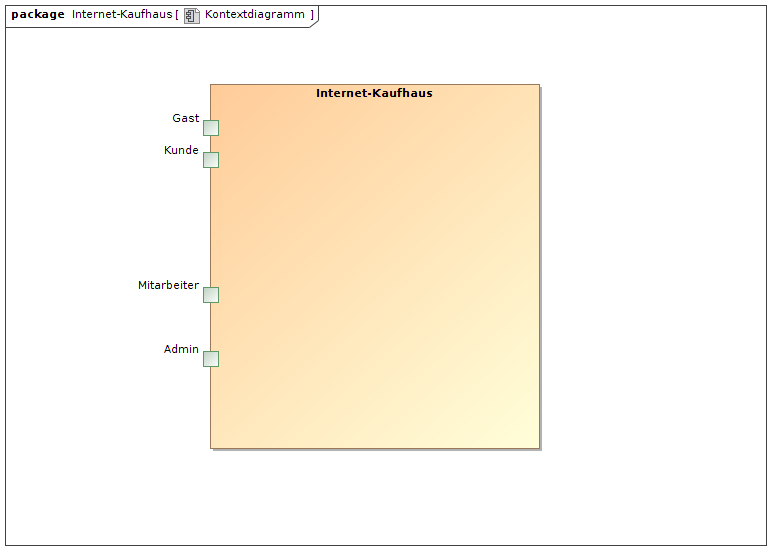

:imagesdir: ./Bilder

= Pflichtenheft

== Projektname

__Version:__    *0.1.2*

__Status:__     *In Arbeit*

__Stand:__      *1.11.2015*

== Zusammenfassung
Das vorliegende Dokument enthält einen Plan zur Erstellung eines Internet-Einkaufsdienstes für das Warenhaus "Emma".
Neben den geforderten Funktionalitäten und Nutzerrollen, werden Programmabläufe und -strukturen visuell und textuell dargestellt. Auch ein GUI-Prototyp für die Web-Oberfläche liegt bei.

== Inhaltsverzeichnis

== Aufgabenstellung und Zielsetzung
Software für Onlineshop erstellen, mitunter Kundenlogin, Katalogverwaltung, Personalverwaltung, Lagerbestandsübersicht, Rabattsystem, Retourensystem, Gewinnspiel, Bilanzübersicht und Newsletter einfügen. Die Benutzer sind aufgeteilt in Gäste, Kunden, Mitarbeiter und Administratoren.

Text aus Aufgabenstellung kopieren und ggfs. präzisieren.

== Fachlicher Überblick
Im folgenden Kapitel werden Arbeitsabläufe und Attribute von Programm-Modulen erläutert. Die verschiedenen Nutzerrollen werden erklärt.
Im Pflichtenheft befinden sich die vertraglich Vereinbarten Funktionalitäten.

== Systemgrenze und Top-Level-Architektur

=== Kontextdiagramm

=== Top-level architecture
image::Top-Level-Architecture_Diagramm.png[Top Level Architecture Diagramm]

== Anwendungsfälle

=== Überblick Anwendungsfalldiagramm

image::Use-Case-Diagramm.png[Use Case Diagramm]

// See http://asciidoctor.org/docs/user-manual/#tables
[options="header"]
|===
|Name |Beschreibung 
|Gast  |Gäste sind Nutzer, die noch kein Konto erstellt haben. Kann Artikel sehen und im Warenkorb ablegen, Newsletter abonnieren/abbestellen, sich anmelden/registrieren. 
|Kunde  |Kunde ist eingeloggt, dh hat sich ein Konto erstellt. Hat alle Rechte von "Gast", kann darüber hinaus noch Einkaufen, Retourfunktionen nutzen, Bewerten/Kommentieren, Profildaten ändern, Kunden werben.  
|Mitarbeiter  |Mitarbeiter kann Kommentare zensieren, Lagerbestand überprüfen, Sortiment einkaufen, Katalog bearbeiten. 
|Administrator  |Administrator hat alle Rechte von "Mitarbeiter", kann Personal/Benutzerkonten verwalten, Bilanzen einsehen, Gewinnspiel auslösen. 
|===

=== Anwendungsfallbeschreibungen

Die Anwendungen, welche im Use-Case-Diagramm dargestellt sind teilen sich in vier Gruppen nach den Akteuren ein. Diese sind Gast, Kunde, Mitarbeiter und Administrator. Der Kunde erbt dabei vom Gast und der Administrator vom Mitarbeiter. 
Der Gast (ein Verbraucher ohne Login) hat die Möglichkeit den gesamten Katalog mit allen Artikeln einzusehen. Er kann Artikel in den Warenkorb legen, damit aber nicht zur Kasse gehen. Weiterhin kann er den Newsletter bestellen oder abbestellen. Letzendlich kann er sich registrieren und damit zum Kunden werden. Dieser hat darüber hinaus die Möglichkeit Artikel zu kaufen und zurückzugeben. Er kann Bewertungen abgeben, andere Kunden werben und seine Profildaten ändern. Dies gilt auch und insbesondere für das Passwort, welches dazu noch über eine Passwort-vergessen-Option geändert werden kann.
Der Mitarbeiter erledigt die wichtigsten Aufgaben im Backend. Er ist für die Pflege und Bearbeitung des Katalogs zuständig. In diesem Zusammenhang kann er auch den Lagerbestand der Artikel prüfen und diese auch nach- oder neubestellen. Dies gilt insbesondere für Artikel mit niedrigem Warenbestand. Zuletzt kann er auch Bewertungen löschen. Der Administrator hat neben allen Möglichkeiten bzw. Aufgaben des Mitarbeiters darüber hinaus für die Personalverwaltung zu sorgen. Er kann die Geschäftsergebnisse und Bilanzen einsehen. Außerdem kann nur er das jährliche Gewinnspiel auslösen.

== Anforderungen

=== Muss-Kriterien
Folgende Funktionalitäten gilt es in den Internet-Dienst von "Emma" einzubauen:
Das Sortiment als Ansammlung verschiedener Produkte, die jeweils über ein Bild, Preis, Beschreibung und Bewerung verfügt. Es soll für Mitarbeiter die Möglichkeit bestehen, Produkte neu in das Sortiment einzufügen, zu verändern oder zu löschen.
Das Sortiment wird in einem Katalog aufbereitet, um die Übersicht für den Nutzer zu verbessern. So werden im Katalog Produkte durch Produktkategorien gebündelt.
Produkte können durch Kunden bewertet gekauft und ggf. reklamiert werden. Beim Kauf wird dem Kunde eine Bestätigungs-Mail zugesandt, die auch Produktinformationen enthält. Bei Reklamationen hat der Kunde einen Grund anzugeben.
Durch ein Rabattsystem erhält der Kunde durch jeden geworbenen Kunden Rabatt-Punkte, die er bei seinem Einkauf einsetzen kann.
Ein Gewinnspiel ermöglicht es den erfolgreichsten Werbern eine Kreuzfahrt zu gewinnen. 
Der Nachkauf von Produkten aus dem Lager erfolgt vom Mitarbeiter. Desweiteren sind Mitarbeiter in der Lage einen selbst verfassten Newsletter an Kunden zu verschicken.
Die Bilanzen können vom Admin eingesehen werden. Sie zeigen, wie viele Produkte zu welchem Preis aus dem Lager eingekauft und an Kunden verkauft wurden. Monatlich wird eine neue Bilanz erstellt.
Die Rollen: Gast, Kunde, Mitarbeiter und Admin besitzen verschiedene Zugriffsrechte auf Funktionalitäten.

=== Kann-Kriterien
Folgende Funktionalitäten können den Internetdienst von "Emma" zusätzlich versessern:
Bei Reklamation eines Produktes durch einen Kunden wird automatisch ein Lieferschein für die Rücksendung generiert.
Hinzu kommt, dass der Kunde eine anonyme Produktbewertung vornehmen kann.

== GUI Prototyp

=== Überblick: Dialoglandkarte
Erstellen Sie ein Übersichtsdiagramm, das das Zusammenspiel Ihrer Masken zur Laufzeit darstellt. Also mit welchen Aktionen zwischen den Masken navigiert wird. Die nachfolgende Abbildung zeigt eine an die Pinnwand gezeichnete Dialoglandkarte. Ihre Karte sollte zusätzlich die Buttons/Funktionen darstellen, mit deren Hilfe Sie zwischen den Masken navigieren.

=== Dialogbeschreibung
Für jeden Dialog:

1. Kurze textuelle Dialogbeschreibung eingefügt: Was soll der jeweilige Dialog? Was kann man damit tun? Überblick?
2. Maskenentwürfe (Screenshot, Mockup)
3. Maskenelemente (Ein/Ausgabefelder, Aktionen wie Buttons, Listen, …)
4. Evtl. Maskendetails, spezielle Widgets

== Datenmodell

=== Überblick: Klassendiagramm
UML-Analyseklassendiagramm

=== Klassen und Enumerationen
Dieser Abschnitt stellt eine Vereinigung von Glossar und der Beschreibung von Klassen/Enumerationen dar. Jede Klasse und Enumeration wird in Form eines Glossars textuell beschrieben. Zusätzlich werden eventuellen Konsistenz- und Formatierungsregeln aufgeführt.

// See http://asciidoctor.org/docs/user-manual/#tables
[options="header"]
|===
|Klasse/Enumeration |Beschreibung |
|…                  |…            |
|===

== Aktzeptanztestfälle
Mithilfe von Akzeptanztests wird geprüft, ob die Software die funktionalen Erwartungen und Anforderungen im Gebrauch erfüllt. Diese sollen und können aus den Anwendungsfallbeschreibungen und den UML-Sequenzdiagrammen abgeleitet werden. D.h., pro (komplexen) Anwendungsfall gibt es typischerweise mindestens ein Sequenzdiagramm (welches ein Szenarium beschreibt). Für jedes Szenarium sollte es einen Akzeptanztestfall geben. Listen Sie alle Akzeptanztestfälle in tabellarischer Form auf.
Jeder Testfall soll mit einer ID versehen werde, um später zwischen den Dokumenten (z.B. im Test-Plan) referenzieren zu können.

[options="header"]
|===
D|Szenario|Vorbedingung|Aktion|Nachbedingung
|1.1|Nutzer-Registrierung|Gast hat das Registrierungsformular ausgefuellt, Email Addresse ist bereits registriert| Gast klickt "Registrieren"|Ein Dialog erscheint: Account mit dieser Addresse existiert bereits.\nAccount wird nicht angelegt. Redirect zu Passwort zuruecksetzen.
|1.2|Nutzer-Registrierung|Gast hat das Registrierungsformular ausgefuellt, Daten sind unvollstaendig| Gast klickt "Registrieren"|Ein Dialog erscheint: Markierte Felder sind auszufuellen
|1.3|Nutzer-Registrierung|Gast hat das Registrierungsformular ausgefuellt, Benutzername existiert bereits|Gast klickt "Registrieren"|Ein Dialog erscheint: Benutzername ist bereits vergeben , Redirect zu registrierungsformular
|1.4|Nutzer-Registrierung|Gast hat Valide Daten 1* eingegeben, URL enthaelt assoziierten Account|Gast klickt "Registrieren"|Es wird kein Account angelegt.\nEs wird ein Aktivierungslink per Mail verschickt. Assoziierter Account wird in Feld: "geworben von" eingetragen. Redirect zum login-Screen.
|1.5|Nutzer-Registrierung|Gast hat Valide Daten 1* eingegeben|Gast klickt "Registrieren"|Es wird kein Account angelegt.\nEs wird ein Aktivierungslink per Mail verschickt \nRedirect zum login-Screen.
|2.1|Login|Gast hat korrekte Daten 2* in das Login-Formular eingegeben| Gast klickt "Login"|Gast wechselt Rolle zu Customer. Redirect zur Startseite
|2.2|Login|Gast hat inkorrekte Daten in das Login-Formular eingegeben| Gast klickt "Login"|Gast wird nicht eingeloggt.\nDialog: "Nuzername oder Passwort falsch" erscheint \nRedirect zum Login-Sreen
|2.3|Passwort vergessen|Gast hat Username eingeben|Gast klickt auf "Passwort vergessen"|Passwort-Mail wird versendet
|3.1|Katalog anzeigen|Nutzer ist Gast oder Kunde|"Katalog"-Link klicken|Katalog wird angezeigt
|4.1|Artikelansicht|Nutzer ist Gast oder Kunde |Artikel anklicken|Artikelseite wird angezeigt
|5.1|Warenkorb|Gast oder Kunde hat valide *3 Produktanzahl eingegeben, genuegend Produkte im Lager|"Warenkorb hinzufügen-Button" wird geklickt|Der Artikel wird in den Warenkorb gelegt
|5.2|Warenkorb|Gast oder Kunde hat keine valide Produktanzahl eingegeben|"Warenkorb hinzufügen-Button" wird geklickt|Dialog: Stueckzahl unzulaessig
|5.3|Warenkorb|Gast oder Kunde hat valide Produktanzahl eingegeben, nicht genuegend Produkte im Lager|"Warenkorb hinzufügen-Button" wird geklickt|Dialog: Lieferung derzeit nicht möglich
|6.1|Bestellen|Gast hat einen oder mehr Artikel im Warenkorb|"Kaufen"-Button klicken|Warenkorb wird gespeichert, redirect zum Login-screen
|6.2|Bestellen|Kunde hat einen oder mehr Artikel im Warenkorb, Artikelanzahl Groesser als Bestand|"Kaufen"-Button klicken|Dialog: Ein anderer Kunde war schneller. Redirect zum Warenkorb, Artikelanzahl wird auf maximal verfuegbaren wert gesetzt und rot markiert.
|6.3|Bestellen|Kunde hat einen oder mehr Artikel im Warenkorb, Artikelanzahl kleiner als Bestand, Rabattkontobetrag > 20% des Kaufpreises|"Kaufen"-Button klicken|Artikelmengen werden verringert. Nutzer erhält Bestätigungsmail. Bestellpreis wird um 20% verringert. Rabattpunkte werden dem Rabattkonto abgezogen. Verkauf in Bilanz. 5% des Kaufpreises werden Rabattkonto des Werbers gutgeschrieben. Score des Werbers erhoeht sich um selbigen Betrag. Redirect: Bezahlen
|6.4|Bestellen|Kunde hat einen oder mehr Artikel im Warenkorb, Artikelanzahl kleiner als Bestand, Rabattkontobetrag < 20% des Kaufpreises|"Kaufen"-Button klicken|Artikelmengen werden verringert. Nutzer erhält Bestätigungsmail. Bestellpreis wird um die Anzahl der Rabattpunkte verringert. Rabattkonto wird auf 0 gesetzt. Verkauf in Bilanz. 5% des Kaufpreises werden dem Rabattkonto des Werbers gutgeschrieben. Score des Werbers erhoeht sich um selbigen Betrag. Redirect: Bezahlen
|7.1|Artikel bewerten/kommentieren|Eingeloggter Kunde befindet sich auf Produktseite, Kunde hat diesen Artikel noch nicht bewertet, Kunde hat Bewertungsformular ausgefuellt |Kunde klickt "Bewertung abschicken"|Bewertung wird Mitarbeiter zur Prüfung vorgelegt
|7.2|Artikel bewerten/kommentieren|Eingeloggter Kunde befindet sich auf Produktseite, Kunde hat diesen Artikel bereits bewertet| Kunde klickt: "Bewertung abschicken"|Dialog: Nur eine Bewertung pro Kunde/Artikel zulaessig
|8.1|Profildaten ändern|Eingeloggter Kunde befindet sich auf seiner Profilseite, Kunde hat neue valide 2* Daten eingegeben| Kunde klickt: "Profil Speichern" |Neue Daten werden in die Kundenliste übernommen
|8.2|Profildaten ändern|Eingeloggter Kunde befindet sich auf seiner Profilseite, Kunde hat neue nicht valide 2* Daten eingegeben| Kunde klickt: "Profil Speichern" |Dialog mit unzulaessigen Aenderungen erschient
|9.1|Lagerbestand einsehen|eingeloggter Mitarbeiter befindet sich auf Startseite|Mitarbeiter Klickt: "Lageruebersicht einsehen"|Der Lagerbestand wird aufgelistet
|10.1|Sortiment einkaufen|eingeloggter Mitarbeiter befindet sich in "Lagerbestand einsehen", Mitarbeiter hat valide Anzahl nachzubestellender Artikel eingegeben|Mitarbeiter klickt auf: "Nachbestellung abschicken"|Der Lagerbestand erhöht sich. Der Einkauf wird in der Bilanz verbucht
|10.2|Sortiment einkaufen|eingeloggter Mitarbeiter befindet sich in "Lagerbestand einsehen", Mitarbeiter hat nicht valide Anzahl nachzubestellender Artikel eingegeben|Mitarbeiter klickt auf: "Nachbestellung abschicken"|Dialog: Bestellung unzulaessig, Redirect zu Lagerbestand einsehen
|11.1|Artikel hinzufuegen|eingeloggter Mitarbeiter befindet sich auf Startseite, hat Artikel hinzufuegen ausgewaehlt und Artikelformular mit validen Daten ausgefuellt|Mitarbeiter klickt auf: "dem Sortiment hinzufuegen"|Der Artikel erscheint im Katalog/Lager mit einem Bestand von 0
|11.2|Artikel hinzufuegen|eingeloggter Mitarbeiter befindet sich auf Startseite, hat Artikel hinzufuegen ausgewaehlt und Artikelformular mit nicht validen Daten ausgefuellt|Mitarbeiter klickt auf: "dem Sortiment hinzufuegen"|Dialog: Einige Angaben sind unzulaessig. redirect zu Produkt hinzufuegen, unzulaessige werte sind markiert.
|11.3|Artikel entfernen|Eingeloggter Mitarbeiter befindet sich in "Lagerbestand einsehen"|Mitarbeiter klickt: "Produkt aus dem Lager entfernen"|Produkt wird geloescht
|12.1|Bewertung ablehnen|Mitarbeiter eingeloggt|Nutzerkommentar wird per Button abgelehnt|Kommentar wird gelöscht
|13.1|Personal verwalten|Admin eingeloggt|Mitarbeiterliste einsehen. Mitarbeiter/Admin anlegen/löschen|Mitarbeiter/Admin wird gespeichert/gelöscht.
|13.2|Personal verwalten|Admin eingeloggt|Letzten Admin entfernen|Fehler: Ein Admin muss erhalten bleiben. \\anmerkung: admins koennen sich nicht selbst loeschen. So ist sichergestellt, dass zumindest ein Admin im System bleibt
|14.1|Gewinnspiel|Admin eingeloggt|"Gewinnspiel auslösen" Button klicken|Die 10% besten Werber werden ausgegeben
|15.1|Kunden werben|eingeloggter Kunde hat Formular: "Kunde werben" ausgefuellt | Kunde klickt: "kunde werben" | Email mit Registrierungslink (verknuepfte Account ID) wird an geworbenen Kunden verschickt. 
|16.1|Rabattsystem|Eingegangene Punkte sind vor >=30 Tagen eingegangen |Rabattabrechnung | Rabattpunkte werden dem Effektiven (dem Kunden sichtbaren Betrag) des Kontos gutgeschrieben
|===
== Offene Punkte
Offene Punkte werden entweder direkt in der Spezifikation notiert. Wenn das Pflichtenheft  zum finalen Review vorgelegt wird, sollte es keine offenen Punkte mehr geben.
